## 一、原型以及原型链
1. 基础概念：
    1. 实例对象的```__proto__```和构造函数的原型prototype指向相同
    1. 实例对象中的```__proto__```原型指向的是构造函数中的prototype原型
    1. 实例对象中的```__proto__```是原型，是浏览器使用的
    1. 构造函数中的prototype是原型，是程序员使用的
    1. 实例对象中的proto指向的是构造函数中的prototype所指向的原型对象，  
        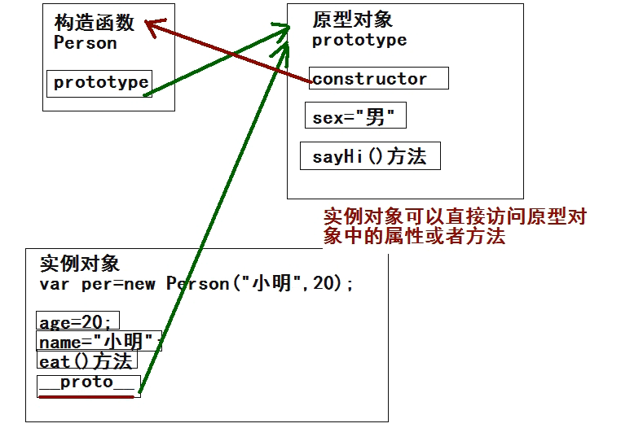
    1. 原型链：是一种关系，实例对象和原型对象之间的关系，这种关系是通过实例对象中的原型（proto）来联系的。
1. 改变原型链指向
    1. 构造函数中的this与原型中this：都是实例对象  
        代码：
        ``` js
        function Student(name){
            this.name = name;
            console.log(this);
        };
        Student.prototype.haha = function(){
            console.log("哈哈哈哈");
            console.log(this);
        }
        var stu = new Student("张三");
        console.log(stu);
        stu.haha();
        ```  
        效果：  
        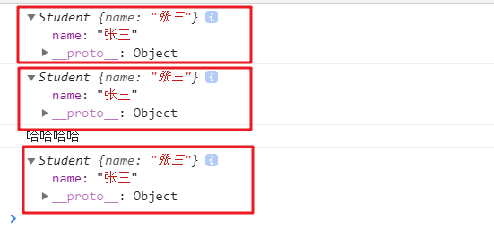
    1. 原型指向改变的分析：  
        1. 原本stu指向自己的是Student构造器中的原型对象
        1. 后来，由于Student构造器中的原型对象重新指向了一个Person对象，所以stu对象中的原型也跟着改变，指向了Person对象中的proto所指向的原型对象（即Person构造器中的原型对象）
            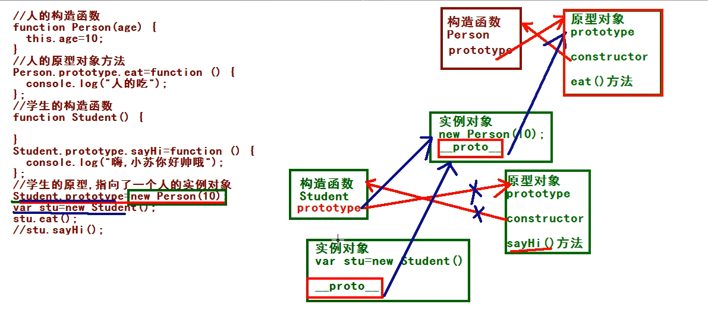
        1. 代码演示： 
            ``` js
            function Student(){
            };
            function Person(name){
                this.name = name;
            };
            Person.prototype.haha = function(){
                console.log("haha");
            };
            Student.prototype = new Person("zhansan");
            var stu = new Student();
            stu.haha();
            console.dir(Student);
            console.dir(stu);
            ```  
            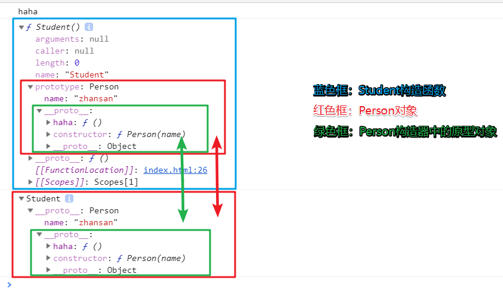
        1. 实例对象和原型对象之间是通过proto来联系的，这种关系就是原型链 
1. 原型链的最终指向
    1. 实例对象中有proto原型；构造器中有prototype原型对象，所以prototye原型对象中有proto对象；
    1. 实例对象中的proto指向的是对应构造函数的prototype原型对象，所以prototype对象原型中的proto指向的是某个构造函数的prototype对象原型。
    1. 所有对象（除了Object）的原型对象，都将通过__proto__，最终指向Object的原型对象，而 ``` Object.prototype.__proto__=null ```。
    1. 代码：  
        ``` js
        function Person(){

        };
        var per = new Person();
        console.log(Person.prototype == per.__proto__);
        console.log(Person.prototype.__proto__ == Object.prototype);
        console.log(Object.prototype.__proto__);
        ```  
        结果：  
        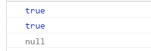  
        分析图：  
        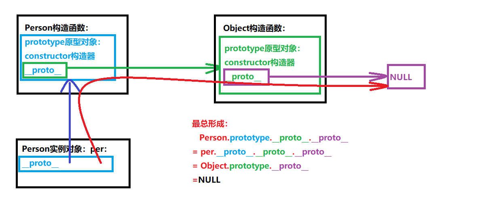  
## 二、继承
1. 继承的几种实现形式：
    1. 通过原型实现继承
        1. 代码：  
            ``` js
            // 父类--动物
            function Animal(color){
                this.color = color;
            }
            Animal.prototype.eat = function(){
                console.log("吃东西");
            };
            // 子类--狗
            function Dog(weight){
                this.weight = weight;
            }
            Dog.prototype = new Animal("yellow");
            Dog.prototype.bite = function(){
                console.log("咬拖鞋");
            };
            // 子类的子类--金毛
            function JinMao(age){
                this.age = age;
            }
            JinMao.prototype = new Dog("20kg");
            JinMao.prototype.clever = function(){
                console.log("机智");
            }
            console.dir(new Animal("grey"));
            console.dir(new Dog("30kg"));
            console.dir(new JinMao("5岁"));
            var jinMao = new JinMao("6岁");
            jinMao.eat();
            jinMao.bite();
            jinMao.clever();
            ```
        1. 结果：  
            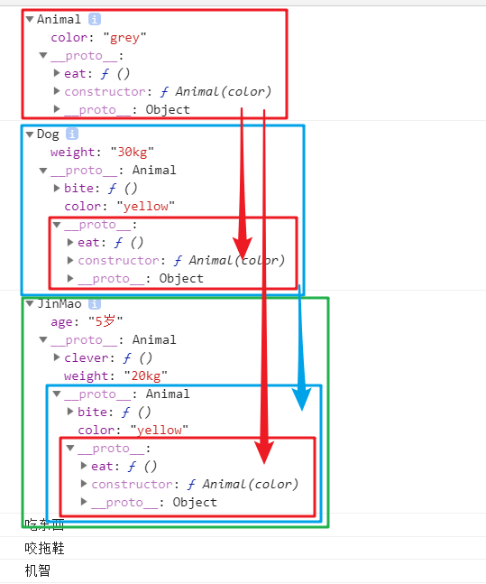
        1. 分析图
            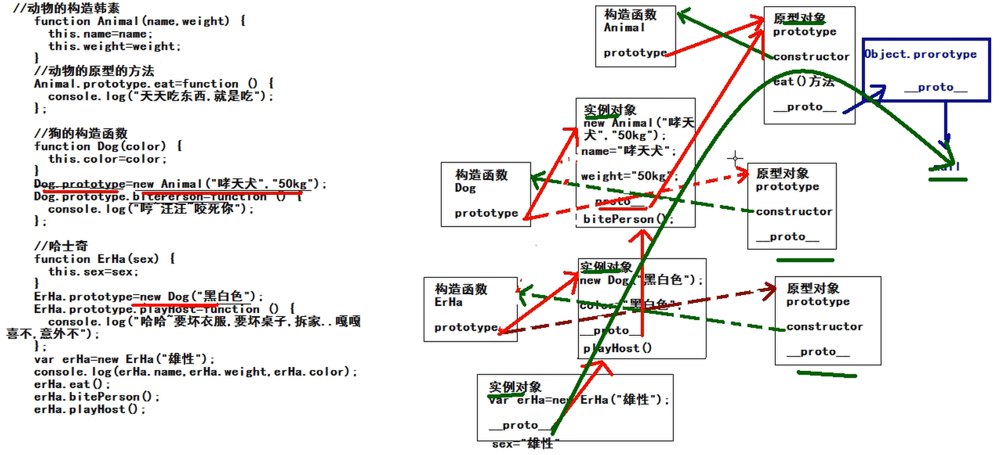
    1. 通过借用父级构造函数实现继承
        1. 为什么要“借用”父级构造函数？
            前一种通过原型链方式实现的继承，不仅继承了父类的属性，还继承了父类属性的值，而父类属性的值是子类不需要的，在实际使用中还需要额外的代码对子类的属性重新赋值，这其实没有必要，我们想要的继承就是继承属性，不继承属性的值；
        1. 核心代码：```父类.call(this,p1,p2...);```
            代码：  
            ``` js
            // 父类
            function Person(name,age){
                this.name = name;
                this.age = age;
            }
            Person.prototype.haha = function(){
                console.log("haha");
            }
            // 子类
            function Student(name,age,score){
                Person.call(this,name,age,score);
                this.score = score;
            }
            var stu = new Student("张三",18,99);
            console.dir(stu);
            stu.haha();
            ```  
            效果：  
            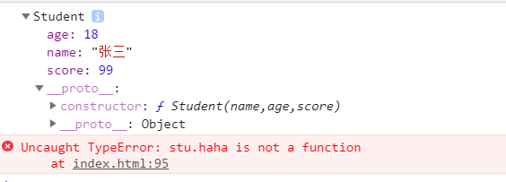  
            缺陷：  
            由于只是“借用”了父类的构造函数，所以只能继承父类属性，而父类原型链中的方法确未被子类继承，因此调用失败；
    1. 组合继承：既使用原型链方式继承父类方法，又“借用”父类构造器继承父类属性  
        代码：  
        ``` js
        function Person(name,age){
            this.name = name;
            this.age = age;
        };
        Person.prototype.haha = function(){
            console.log("hahahah");
        };
        function Student(name,age,score){
            // 借用父级构造函数继承父类属性
            Person.call(this,name,age,score);
            this.score = score;
        }
        // 改变原型指向（指向不含属性的父类对象），仅继承父类的原型方法
        Student.prototype = new Person();
        Student.prototype.study = function(){
            console.log("学习学习");
        };
        var student = new Student("小明",18,90);
        console.dir(student);
        student.haha();
        student.study();
        ```  
        结果：  
        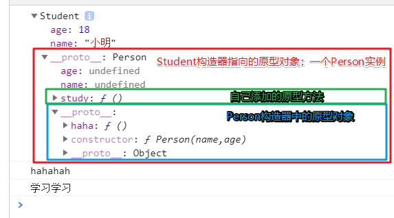  
    1. 拷贝继承：遍历拷贝每个属性
        代码：  
        ``` js
        function Person(name,age){
            this.name = name;
            this.age = age;
        }
        Person.prototype.haha = function(){
            console.log("haha");
        }

        var per = new Person("张三",19);
        var obj = {};
        for(var key in per){
            obj[key] = per[key];
        }
        console.dir(obj);
        obj.haha();
        ```  
        结果：  
        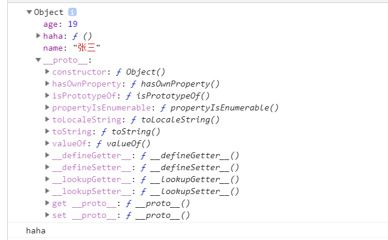  
    1. 一个继承逆推的例子：  
        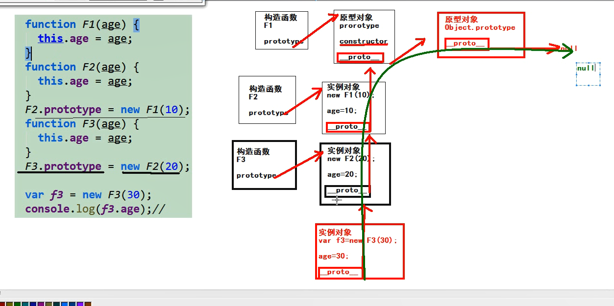  
## 三、函数
1. 函数的角色分为：函数的声明、函数的表达式
    代码：  
    ```js
    // 函数的声明
    function f1(){
        console.log(111);
    }
    // 函数表达式
    var f2 = function(){
        console.log(222);
    }
    f1();
    f2();
    ```  
    结果：  
    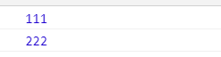  
1. 三种函数(普通函数、构造函数、对象方法)的调用方式：  
    代码：  
    ``` js
    // 不同函数的调用方式
    function f1(){
        console.log("1111");
    }
    f1();// 普通函数：直接调用
    function Person(){
        console.log("this is a constructor");
    }
    var per = new Person();//构造函数：通过‘new’关键字调用
    function Game(){
        this.play = function(){
            console.log("play~");
        }
    }
    new Game().play();// 对象方法：通过[对象.方法]的形式调用；
    ```  
    结果：  
    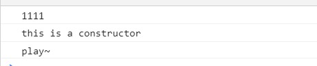  
1. 函数也是对象
    1. 函数一定是对象，但对象不一定是函数；
    1. 对象中__proto__原型，（构造）函数中有prototype原型对象；
    1. 可以认为，有__proto__原型的就是对象，有prototype的就是函数；
    1. 如果一个东西里面，既有prototype原型对象，又有__proto__原型，则它既是函数，又是方法；
    1. 所有的函数，都是由Function构造器创建出来的实例对象  
    代码：  
    ``` js
    function f1(){};
    console.dir(f1);
    console.log(f1.__proto__ == Function.prototype);
    ```  
    结果：  
    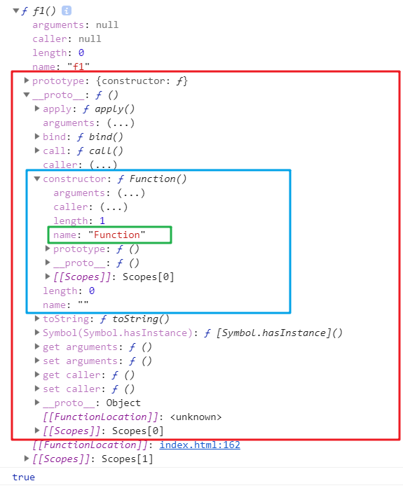  
1. 数组中函数的调用  
    代码：  
    ``` js
    var arr = [
        function(){
            console.log(11);
        },
        function(){
            console.log(22);
        },
        function(){
            console.log(33);
        },
        function(){
            console.log(44);
        }
    ];
    // 回调函数：将函数作为参数传入
    arr.forEach(function(ele){
        ele();
    });
    ```  
    结果：  
    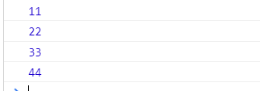  
## PS：零散知识点：
1. 报错：xxx is not defined与undefined
    代码：  
    ```js
    function Person(){

    };
    var per = new Person();
    // 在js中，只要是通过【对象.xxx】形式调用该对象未定义的xxx属性，就间接定义了该对象中的xxx属性，对应的值是undefined;
    console.log(per.wrehtjewfgberf);
    // 而直接使用一个未定义的xxx变量，则会报错
    console.log(trhjhngbfaergthey);
    ```
    结果：  
    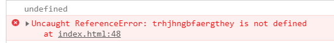
    引申：  
    1. Object.prototype中没有__proto__属性，所以``` Object.prototype.__proto__=null```  
    1. 代码：  
        ``` js
        console.log(Object.prototype.__proto__);
        console.log(new Object().__proto__);
        console.log(new Object().__proto__.__proto__);
        ```  
    1. 结果：  
        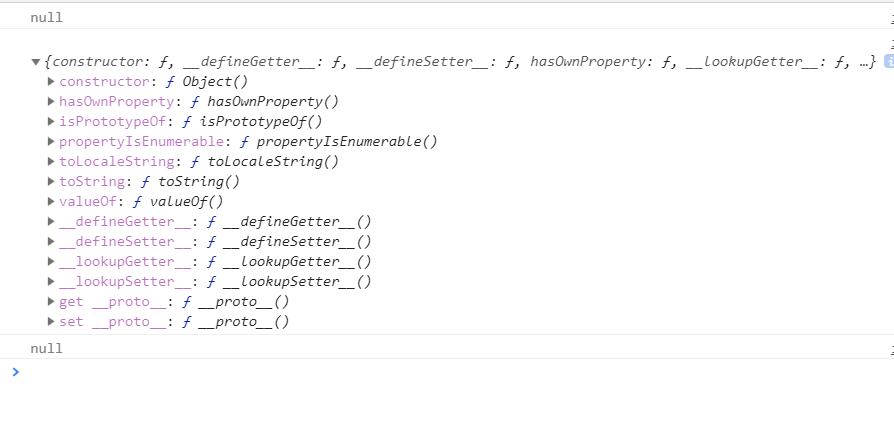  