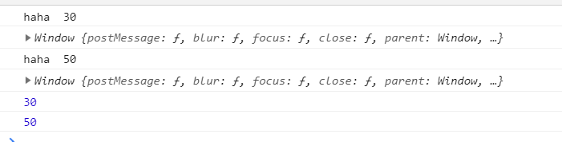
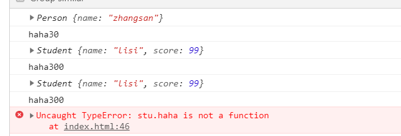
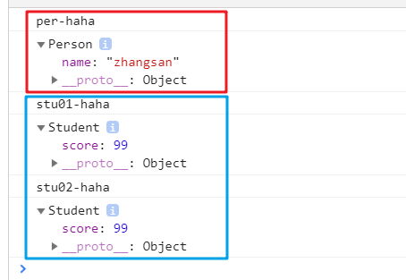
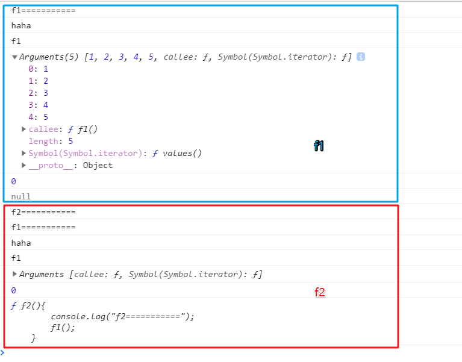
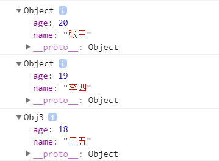

## 一、apply与call方法、bind方法的使用【重点】
1. apply方法与call方法
    1. 间接调用方法：  
        代码：  
        ``` js
        function haha(x,y){
            console.log("haha  "+(x+y));
            console.log(this);
            return x+y;
        } 
        var num1 = haha.call(window,10,20);
        var num2 = haha.apply(null,[20,30]);
        console.log(num1);
        console.log(num2);
        ```
        结果：  
        
    1. 改变this的指向
        ``` js
        function Person(name){
            this.name = name;
        }
        Person.prototype.haha = function(x,y){
            console.log(this);
            console.log("haha"+(x+y));
            return x+y;
        }
        function Student(name,score){
            this.name = name;
            this.score = score;
        }
        var per = new Person("zhangsan");
        var stu = new Student("lisi",99);
        // 原生调用
        var perNum = per.haha(10,20);
        // 通过apply改变this指向
        var stuNum01 = per.haha.apply(stu,[100,200]);
        // 通过call改变this指向
        var stuNum02 = per.haha.call(stu,100,200);
        // 只是改变了this指向，而方法依然是Person的prototype原型对象的，下属方法调用失败
        stu.haha(1,2);
        ```  
        结果：  
        
1. bind方法
    1. 作用：将一个对象的某个方法【复制】成另一个对象的方法
    1. 代码：
        ``` js
        function Person(name){
            this.name = name;
        }
        Person.prototype.haha = function(word){
            console.log(word);
            console.dir(this);
        }
        function Student(score){
            this.score = score;
        }
        var per = new Person("zhangsan");
        per.haha("per-haha");
        var stu = new Student(99);
        var stuHahaFunc01 = per.haha.bind(stu,"stu01-haha");
        var stuHahaFunc02 = per.haha.bind(stu);
        // stuHahaFunc01、stuHahaFunc02在调用时，不用加“stu.”
        stuHahaFunc01();
        stuHahaFunc02("stu02-haha");
        ```  
    1. 效果：  
        

  
## 二、函数中几个成员的介绍【了解】  
1. name属性  
    函数的名字，只读，不可重新赋值
1. arguments属性  
    函数形参
1. length属性
    函数实参的个数
1. caller属性
    函数调用者
1. 代码：  
    ``` js
    function f1(){
        console.log("f1===========");
        console.log("haha");
        console.log(f1.name);
        console.log(f1.arguments);
        console.log(f1.length);
        console.log(f1.caller);
    }
    f1(1,2,3,4,5);
    function f2(){
        console.log("f2===========");
        f1();
    }
    f2();
    ```  
1. 结果：  
    

## 三、高阶函数（函数作为参数、函数作为返回值）【了解】

## 四、作用域、作用域链、域解析【了解】

## 五、闭包【重点】

## 六、沙箱【重点】

## 七、递归

## PS：零散知识点：
1. 创建对象的三种形式：字面量方式、调用系统构造函数、调用自定义构造函数：
    代码：  
    ``` js
    // 字面量形式
    var obj1 = {
        name : "张三",
        age : 20
    };
    // 调用系统构造函数：
    var obj2 = new Object();
    obj2.name = "李四";
    obj2.age = 19;
    // 调用自定义构造函数：
    function Obj3(name,age){
        this.name = name;
        this.age = age;
    }
    var obj3 =  new Obj3("王五",18);
    console.log(obj1);
    console.log(obj2);
    console.log(obj3);
    ```  
    结果：  
    