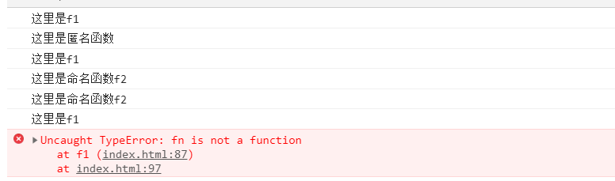
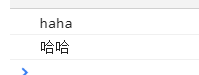
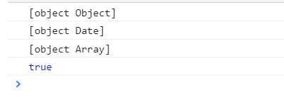
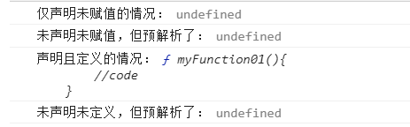

## 一、apply与call方法、bind方法的使用【重点】
1. apply方法与call方法
    1. 间接调用方法：  
        代码：  
        ``` js
        function haha(x,y){
            console.log("haha  "+(x+y));
            console.log(this);
            return x+y;
        } 
        var num1 = haha.call(window,10,20);
        var num2 = haha.apply(null,[20,30]);
        console.log(num1);
        console.log(num2);
        ```
        结果：  
        
    1. 改变this的指向
        ``` js
        function Person(name){
            this.name = name;
        }
        Person.prototype.haha = function(x,y){
            console.log(this);
            console.log("haha"+(x+y));
            return x+y;
        }
        function Student(name,score){
            this.name = name;
            this.score = score;
        }
        var per = new Person("zhangsan");
        var stu = new Student("lisi",99);
        // 原生调用
        var perNum = per.haha(10,20);
        // 通过apply改变this指向
        var stuNum01 = per.haha.apply(stu,[100,200]);
        // 通过call改变this指向
        var stuNum02 = per.haha.call(stu,100,200);
        // 只是改变了this指向，而方法依然是Person的prototype原型对象的，下属方法调用失败
        stu.haha(1,2);
        ```  
        结果：  
        
1. bind方法
    1. 作用：将一个对象的某个方法【复制】成另一个对象的方法
    1. 代码：
        ``` js
        function Person(name){
            this.name = name;
        }
        Person.prototype.haha = function(word){
            console.log(word);
            console.dir(this);
        }
        function Student(score){
            this.score = score;
        }
        var per = new Person("zhangsan");
        per.haha("per-haha");
        var stu = new Student(99);
        var stuHahaFunc01 = per.haha.bind(stu,"stu01-haha");
        var stuHahaFunc02 = per.haha.bind(stu);
        // stuHahaFunc01、stuHahaFunc02在调用时，不用加“stu.”
        stuHahaFunc01();
        stuHahaFunc02("stu02-haha");
        ```  
    1. 效果：  
        

  
## 二、函数中几个成员的介绍【了解】  
1. name属性  
    函数的名字，只读，不可重新赋值
1. arguments属性  
    函数形参
1. length属性
    函数实参的个数
1. caller属性
    函数调用者
1. 代码：  
    ``` js
    function f1(){
        console.log("f1===========");
        console.log("haha");
        console.log(f1.name);
        console.log(f1.arguments);
        console.log(f1.length);
        console.log(f1.caller);
    }
    f1(1,2,3,4,5);
    function f2(){
        console.log("f2===========");
        f1();
    }
    f2();
    ```  
1. 结果：  
    

## 三、高阶函数（函数作为参数、函数作为返回值）【了解】
1. 函数作为参数传入：
    1. 代码：  
        ``` js
        function f1(fn){
            console.log("这里是f1");
            fn();
        }
        f1(function(){
            console.log("这里是匿名函数");
        })
        function f2(){
            console.log("这里是命名函数f2");
        }
        f1(f2);
        // 函数作为参数传入时，不能有括号（加括号传入表示把f2的返回值传入f1），下述代码报错
        f1(f2());
        ```  
    1. 结果：  
          
1. 函数作为返回值
    1. 语法结构：``` return function(){...}; ```
        1. 代码：
            ``` js
            function returnFunc(){
                // 函数作为返回值的时候可以不写函数名
                return function (words){
                    console.log(words);
                }
            }
            var myFunc = returnFunc();
            myFunc("haha");
            myFunc("哈哈");
            ```
        1. 效果：
              
    1. 唠叨两句：
        1. 函数作为返回值的时候常称为“回调函数”，即在A函数调用完后，可以将其返回值作为函数B进行调用
        1. 代码：
            ``` js
            console.log(Object.prototype.toString());
            console.log(Object.prototype.toString.call(new Date()));
            console.log(Object.prototype.toString.call([]));

            function getType(type){
                return function(obj){
                    return Object.prototype.toString.call(obj) == type;
                }
            }
            var myFunc = getType("[object Date]");
            console.log(myFunc(new Date()));
            ```
        1. 效果：
              
    1.  typeof 与 instanceof
        1. typeOf：``` typeof 对象 ;```，用于获取对象的类型；
        1. instanceof：``` 对象 instanceof 类名;```，用于判断某个对象是否是指定的类型
        1. 代码：  
            ``` js
            console.log(typeof new Object());   // object
            console.log(new Object instanceof Object);  //true
            ```
1. 函数作为参数、返回值的使用实例：将电影对象的数组根据名称、大小、时间重新排序
    ``` js
    function Film(name,size,date){
        this.name = name;
        this.size = size;
        this.date = date;
    }
    var f1=new Film("bianxingjingang.mp4","700M","2019-10-10");
    var f2=new Film("liulangdiqiu.mp4","900M","2016-02-10");
    var f3=new Film("kuaibawogedaizou.mp4","500M","2017-7-20");
    var filmArr = [f1,f2,f3];
    // 将函数B作为返回值的函数A，可以将函数A理解为函数B的生成器，即调用一下函数A，就能生成一个函数B
    function genMyComparator(attr){
        return function(obj1,obj2){
            if(obj1[attr] > obj2[attr]) return 1;
            else if(obj1[attr] == obj2[attr]) return 0;
            else return -1;
        }
    }
    // 函数作为参数
    console.dir(filmArr.sort(genMyComparator("name")));
    // console.dir(filmArr.sort(genMyComparator("size")));
    // console.dir(filmArr.sort(genMyComparator("date")));
    ```

## 四、作用域、作用域链、预解析【了解】
1. 作用域与作用域链
    1. js中没有局部作用域的概念（现用let关键字可以定义局部变量）
    1. 不同的层级中定义了同名变量，则在调用的时候从里往外找，先找到哪个就用哪个
1. 预解析
    1. 概念：浏览器在执行js代码之前，会将变量的声明（仅声明，不包括赋值操作）与函数的定义提到代码的最前面
        1. 代码：  
            ``` js
            var noValue01;
            console.log("仅声明未赋值的情况：",noValue01);
            // console.log("未声明未赋值的情况",noValue02); // 报错
            console.log("未声明未赋值，但预解析了：",noValue03);
            var noValue03="haha";

            function myFunction01(){
                //code
            };
            console.log("声明且定义的情况：",myFunction01);
            console.log("未声明未定义，但预解析了：",myFunction02);
            // console.log("未声明未赋值的情况",myFunction03); // 报错
            var myFunction02 = function(){
                //code
            }
            ```
        1. 效果：
             

## 五、闭包【重点】

## 六、沙箱【重点】

## 七、递归

## PS：零散知识点：
1. 创建对象的三种形式：字面量方式、调用系统构造函数、调用自定义构造函数：
    代码：  
    ``` js
    // 字面量形式
    var obj1 = {
        name : "张三",
        age : 20
    };
    // 调用系统构造函数：
    var obj2 = new Object();
    obj2.name = "李四";
    obj2.age = 19;
    // 调用自定义构造函数：
    function Obj3(name,age){
        this.name = name;
        this.age = age;
    }
    var obj3 =  new Obj3("王五",18);
    console.log(obj1);
    console.log(obj2);
    console.log(obj3);
    ```  
    结果：  
    