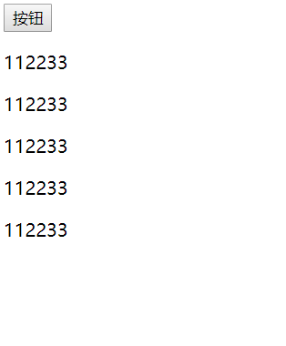
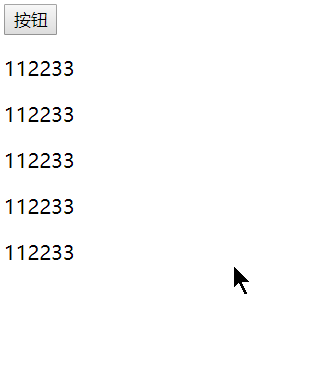
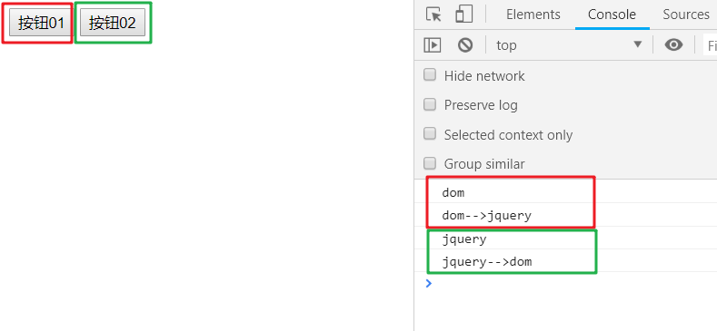

## 1. 体验jQuery
1. 原本通过原生js需要大量代码实现的功能，现在通过jQuery只需少量代码
    1. 案例：点击按钮改变文字内容
        1. js实现
            1. 代码：  
                ``` html
                <body>
                    <button id="btn">按钮</button>
                    <p>112233</p>
                    <p>112233</p>
                    <p>112233</p>
                    <p>112233</p>
                    <p>112233</p>
                </body>
                <script>
                    // 原生js
                    document.getElementById("btn").onclick = function(){
                        var pArr = document.getElementsByTagName("p");
                        for (var i = 0; i < pArr.length; i++) {
                            pArr[i].innerText="hahaha";            
                        }
                    }
                </script>
                ```
            1. 效果： 
                
        1. 通过jQuery实现  
            1. 代码：  
            ``` html
            <body>
                <button id="btn">按钮</button>
                <p>112233</p>
                <p>112233</p>
                <p>112233</p>
                <p>112233</p>
                <p>112233</p>
            </body>
            <script src="jquery-1.12.1.min.js"></script>
            <script>
                $("#btn").click(function(){
                    $("p").text("jquery");
                })
            </script>
            ```
            1. 效果：  
                
## 1. jQuery中的顶级对象
1. 概述：
    1. jQuery中的顶级对象是jQuery，可以用$代替，jquery.xx.js下所有的东西（属性、方法等）都是jQuery(或$)下的；
    1. 如果需要使用jQuery下的属性或者方法，就要通过```jquery.属性```、```jquery.方法()```,或简写作```$.属性```、```$.方法()```;
    1. jQuery基本上把所有的DOM事件都封装成了方法
        1. DOM中的注册事件  
            ```document.getElementById(id).onclick = function(){...};```
        1. jQuery中的注册事件  
            ```$("#id").click(function(){...});```

## 1. jQuery对象与DOM对象互转
1. 为什么要将DOM对象与jQuery对象互相转换：例如我们需要处理兼容性问题，而jquery已有现成的封装，则可以将dom对象转换为jQuery对象，直接使用jQuery对象处理兼容性问题；而反之，某些情况下现有的jquery不能帮我们处理的事情，就需要将当前的jQuery对象转换为dom对象，使用原生的js或者其他js库来处理。
1. 代码：  
    ``` js
    // dom对象与jQuery对象互转
    var domObj = document.getElementById("btn01");
    var jqueryObj = $("#btn02");
    domObj.onclick = function(){
        console.log("dom");
    }
    jqueryObj.click(function(){
        console.log("jquery");
    })
    $(domObj).click(function(){
        console.log("dom-->jquery");
    })
    jqueryObj[0].onclick = function(){
        console.log("jquery-->dom");
    }
    ```
1. 结果：  
    

## 1. jQuery使用
1. 案例1：使用jQuery实现网页开灯关灯的效果
    1. 代码：
        ``` html
        <body>
            <input type="button" value="开灯">
        </body>
        <script src="jquery-1.12.1.min.js"></script>
        <script>
            $("input").click(function(){
                if($(this).val() == "关灯"){
                    $("body").css("background-color","#333");
                    $(this).val("开灯");
                }else if($(this).val() == "开灯"){
                    $("body").css("background-color","");
                    $(this).val("关灯");
                }
            })
        </script>
        ```  
    1. 结果：  
        
    1. 唠叨两句：
        代码中的```this```指的是dom对象，需要通过```$(this)```的方式转换为jQuery对象