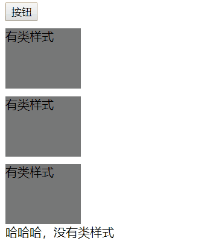

## 1. 体验jQuery
1. 原本通过原生js需要大量代码实现的功能，现在通过jQuery只需少量代码
    1. 案例：点击按钮改变文字内容
        1. js实现
            1. 代码：  
                ``` html
                <body>
                    <button id="btn">按钮</button>
                    <p>112233</p>
                    <p>112233</p>
                    <p>112233</p>
                    <p>112233</p>
                    <p>112233</p>
                </body>
                <script>
                    // 原生js
                    document.getElementById("btn").onclick = function(){
                        var pArr = document.getElementsByTagName("p");
                        for (var i = 0; i < pArr.length; i++) {
                            pArr[i].innerText="hahaha";            
                        }
                    }
                </script>
                ```
            1. 效果： 
                
        1. 通过jQuery实现  
            1. 代码：  
            ``` html
            <body>
                <button id="btn">按钮</button>
                <p>112233</p>
                <p>112233</p>
                <p>112233</p>
                <p>112233</p>
                <p>112233</p>
            </body>
            <script src="jquery-1.12.1.min.js"></script>
            <script>
                $("#btn").click(function(){
                    $("p").text("jquery");
                })
            </script>
            ```
            1. 效果：  
                
## 1. jQuery中的顶级对象
1. 概述：
    1. jQuery中的顶级对象是jQuery，可以用$代替，jquery.xx.js下所有的东西（属性、方法等）都是jQuery(或$)下的；
    1. 如果需要使用jQuery下的属性或者方法，就要通过```jquery.属性```、```jquery.方法()```,或简写作```$.属性```、```$.方法()```;
    1. jQuery基本上把所有的DOM事件都封装成了方法
        1. DOM中的注册事件  
            ```document.getElementById(id).onclick = function(){...};```
        1. jQuery中的注册事件  
            ```$("#id").click(function(){...});```

## 1. jQuery对象与DOM对象互转
1. 为什么要将DOM对象与jQuery对象互相转换：例如我们需要处理兼容性问题，而jquery已有现成的封装，则可以将dom对象转换为jQuery对象，直接使用jQuery对象处理兼容性问题；而反之，某些情况下现有的jquery不能帮我们处理的事情，就需要将当前的jQuery对象转换为dom对象，使用原生的js或者其他js库来处理。
1. 代码：  
    ``` js
    // dom对象与jQuery对象互转
    var domObj = document.getElementById("btn01");
    var jqueryObj = $("#btn02");
    domObj.onclick = function(){
        console.log("dom");
    }
    jqueryObj.click(function(){
        console.log("jquery");
    })
    $(domObj).click(function(){
        console.log("dom-->jquery");
    })
    jqueryObj[0].onclick = function(){
        console.log("jquery-->dom");
    }
    ```
1. 结果：  
    

## 1. jQuery使用
1. 案例1：使用jQuery实现网页开灯关灯的效果
    1. 代码：
        ``` html
        <body>
            <input type="button" value="开灯">
        </body>
        <script src="jquery-1.12.1.min.js"></script>
        <script>
            $("input").click(function(){
                if($(this).val() == "关灯"){
                    $("body").css("background-color","#333");
                    $(this).val("开灯");
                }else if($(this).val() == "开灯"){
                    $("body").css("background-color","");
                    $(this).val("关灯");
                }
            })
        </script>
        ```  
    1. 结果：  
        
    1. 唠叨两句：
        代码中的```this```指的是dom对象，需要通过```$(this)```的方式转换为jQuery对象
1. jQuery中的几个方法：  
    1. val():设置或获取表单标签中value的值
    1. text():设置或获取标签中的文本内容，相当于dom中的innerText  
    1. css():设置元素css样式
    1. html():设置或改变html标签中的html内容，相当于dom中的innerHtml
    1. 代码：  
        ``` js
        <script>
            $(function(){
                $("input").click(function(){
                    console.log("当前按钮的值是：",$(this).val());
                    $(this).val("被点击了");
                    console.log("文本内容是：",$("p").text()); 
                    $("p").text("文本内容改变");
                    $("div").html("<span>又来一个文本</span>") ;
                    $("body").css("background-color","#aaa");
                })
            })
        </script>
        <body>
            <input type="button" value="哈哈哈">
            <p>假装是文本</p>
            <div></div>
        </body>
        ```
    1. 结果：  
        
1. 页面加载函数
    1. 案例（什么时候需要页面加载函数）
        ``` html
        <script src="jquery-1.12.1.min.js"></script>
        <script>
            // 无效
            $("input").click(function(){
                console.log("haha无效");
            })
        </script>
        <body>
            <input type="button" value="按钮">
        </body>
        ```
        1. 无效的原因：点击事件绑定的时候，页面上还没有加载input标签
        1. 解决措施：一种比较容易想到的就是将script标签写到body标签的后面，现重点讲述另一种方式：使用页面加载函数
    1. 基于dom的页面加载函数（原生js）
        1. 1种实现方式：```window.onload = function(){...}; ```；但是这相当于赋值操作，意味这如果页面上有多个```window.onload```,则只有最后一个```window.onload```有效
        1. 代码：  
            ``` html
            <script>
                window.onload = function(){
                    $("input").click(function(){
                        console.log("haha有效01");
                    })
                }
                window.onload = function(){
                    $("input").click(function(){
                        console.log("haha有效02");
                    })
                }
            </script>
            <body>
                <input type="button" value="按钮">
            </body>
            ```  
        1. 效果：  
                
    1. 基于jQuery的页面加载函数  
        1. 4种实现方式：
            1. ```$(window).load(function(){...}); ```
            1. ```$(document).ready(function(){...}); ```
            1. ```jQuery(function(){...}); ```
            1. ```$(function(){...}); ```
        1. 代码：  
           ```js 
           <script>
                $(window).load(function(){
                    $("input").click(function(){
                        console.log("haha,jquery有效01");
                    })
                });
                $(document).ready(function(){
                    $("input").click(function(){
                        console.log("haha,jquery有效02");
                    });
                });
                jQuery(function(){
                    $("input").click(function(){
                        console.log("haha,jquery有效03");
                    });
                });
                $(function(){
                    $("input").click(function(){
                        console.log("haha,jquery有效04");
                    });
                })
            </script>
            <body>
                <input type="button" value="按钮">
            </body>
           ```
        1. 效果： 
                
1. jQuery选择器与dom选择器
    1. DOM中获取元素方式:
        1. 根据id获取元素  
            ```document.getElementById("id属性的值");```  
        1. 根据标签名字获取元素  
            ```document.getElementsByTagName("标签名字");```  
        1. 根据name属性获取元素  
            ```document.getElementsByName("name属性的值");```  
        1. 根据类样式名字获取元素  
            ```document.getElementsByClassName("类样式的名字");```  
        1. 根据选择器获取元素  
            ```document.querySelector("选择器"); //id选择器,类选择器,标签选择器...一个```  
            ```document.querySelectorAll("选择器"); //多个的```  
    1. jQuery中获取元素的方式:  
        1. ```$("选择器") //jQuery对象```  
1. jQuery选择器
    1. 代码：  
        ``` html
        <style>
            .cls{
                width: 100px;
                height: 80px;
                margin-top: 10px;
                background-color: #777;
            }
        </style>
        <script src="jquery-1.12.1.min.js"></script>
        <script>
            $(function(){
                // 标签选择器
                $("input").click(function(){
                    // 类选择器
                    $(".cls").css("background-color","#ddd");
                    $(".cls").css("border","2px solid black");
                });
            })
        </script>
        <body>
            <input type="button" value="按钮">
            <div class="cls">有类样式</div>
            <div class="cls">有类样式</div>
            <div class="cls">有类样式</div>
            <div >哈哈哈，没有类样式</div>
        </body>
        ```
    1. 效果：  
        
1. 案例：使用jQuery的选择器实现隔行变色：
    1. 代码：  
        ``` html
        <script>
            $(function(){
                $("input").click(function(){
                    $("ul>li:odd").css("background-color","#aaa");
                    $("ul>li:even").css("background-color","#555");
                });
            })
        </script>
        <body>
            <input type="button" value="点击变色">
            <ul>
                <li>11</li>
                <li>22</li>
                <li>33</li>
                <li>44</li>
                <li>55</li>
                <li>66</li>
                <li>77</li>
                <li>88</li>
                <li>99</li>
                <li>10</li>
            </ul>
        </body>
        ```
    1. 效果：  
     
1. 案例：下拉菜单：
    1. stop()函数的作用是清空当前对象的动画状态，防止鼠标移动得比动画快，造成鼠标早就离开了，但动画还在反复执行的问题
    1. show()、hide()方法分别表示显示和隐藏，可以传入long型的数据，表示显示或隐藏执行的时间，单位毫秒
    1. js代码： 
        ``` js
        <script>
            $(function(){
                $(".wrap>ul>li").mouseenter(function(){
                    $(this).children("ul").stop().show(200);
                })
                $(".wrap>ul>li").mouseleave(function(){
                    $(this).children("ul").stop().hide(200);
                })
            })
        </script>
        ```
    1. 效果： 
        
1. 案例：淘宝广告：
    1. 思路：整个广告分为左中右三个部分，左侧li的索引为0-9，右侧li的索引为10-18，将左侧与右侧的li绑定鼠标移入事件，根据鼠标移入获取li的索引，再将中间索引对应的图片那显示出来
    1. 代码：  
        ``` js
        $(function(){
            $(".wrapper>#left>li").mouseenter(function(){
                var index = $(this).index();
                $("#center>li").hide();
                // 不能写成 $("#center").hide();
                $("#center>li:eq("+index+")").show();
            })
        })
        $(function(){
            $(".wrapper>#right>li").mouseenter(function(){
                var index = $(this).index()+9;
                $("#center>li").hide();
                $("#center>li:eq("+index+")").show();
            })
        })
        ```
    1. 效果：  
        
        

