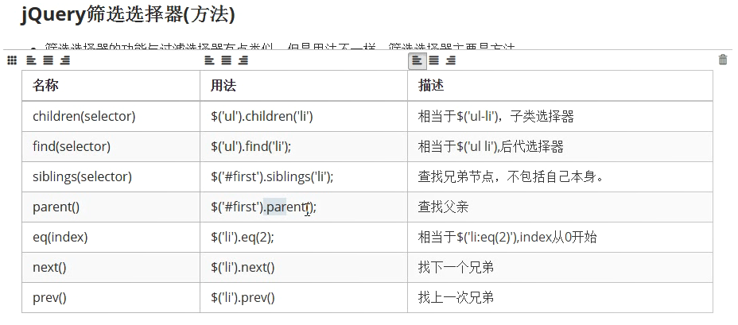
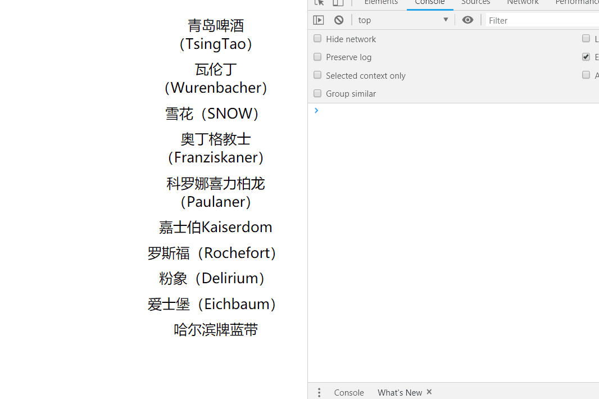

## 1. 索引选择器
1. 三种索引选择器
    1. ``` eq(num); ``` 表示索引值等于num的所有元素
    1. ``` lt(num); ``` 表示索引值小于num的所有元素
    1. ``` gt(num); ``` 表示索引值大于num的所有元素
1. 索引选择器可以一起使用，例如```:lt(num1):gt(num2)```表示索引值大于num2且小于num1的所有元素
1. 代码：  
    ```html
    <script>
        $(function(){
            $("input").click(function(){
                // $("ul>li:eq(1)").css("background-color","#ccc");
                $("ul>li:lt(3)").css("background-color","#ccc");
                $("ul>li:gt(6)").css("background-color","#666");
                $("ul>li:lt(7):gt(2)").css("background-color","#999");
            });
        })
    </script>
    <body>
        <input type="button" value="显示效果" id="btn"/>
        <ul>
            <li>0任贤齐</li>
            <li>1张震岳</li>
            <li>2罗大佑</li>
            <li>3刘德华</li>
            <li>4郭富城</li>
            <li>5张学友</li>
            <li>6黎明</li>
            <li>7周星驰</li>
            <li>8吴孟达</li>
            <li>9周润发</li>
        </ul>
    </body>
    ```
1. 效果：  
    
1. 案例：面板切换
    1. 思路：首先隐藏所有的子菜单，然后鼠标移入时，隐藏所有菜单（目的是清除之前可能的鼠标移入显示的菜单），然后将鼠标所在面板的菜单显示出来，注意在show()、hide()前加上stop()（目的：清除未完成的动画效果）
    1. 代码：  
        ```html
        <script>
            $(function(){
                $("#u1>li>ul").hide();
                $("#u1>li").mouseenter(function(){
                    //隐藏当前被点击的li的兄弟元素的li中的ul（2种不同写法）
                    $("#u1>li>ul").stop().hide(300);
                    //$(this).siblings("li").find("ul").hide(500);
                    $(this).children("ul").stop().show(300);
                });
            })
        </script>
        ```
    1. 效果：  
        

## 2. 元素的样式操作
1. 三种操作样式的方式
    1. 简单粗暴：  
        ```$("#dv").css("width","300px");```  
    1. 链式编程：  
        ```$("#dv").css("width","300px").css("height","200px").css("border","2px solid red");```  
    1. 键值对写法：  
        ```var json={"width":"200px","height":"100px","backgroundColor":"pink","border":"2px solid green"};```  
        ```$("#dv").css(json);```   

## 3. 链式编程
1. 定义: 对象不停的调用方法。对象调用方法,如果返回值还是当前这个对象，那么就可以继续的调用方法
1. 形式：对象.方法().方法.方法().方法();
1. 唠叨两句：在jQuery中,一般情况,对象调用的方法,这个方法的意思是设置的意思,那么返回来的几乎都是当前的对象,就可以继续的链式编程了
1. 代码：  
    ``` js 
    $(function(){
        $("input").click(function(){
            // 取值
            console.log($(this).val());
            // 设置值
            console.log($(this).val("哈哈哈"));
            // 链式编程
            console.log($(this).val("哈哈哈哈").html("<p>112233</p>"));
        })
    })
    ```
1. 效果：  
    

## 4. 筛选器
1. 常用筛选器：  
      
1. 代码：  
    ``` html  
    <script>
      $(function () {
        $("#three").click(function () {
          //获取某个li的下一个兄弟元素
          //$(this).next("li").css("backgroundColor","yellowgreen");
          //获取某个li的前一个兄弟元素
          //$(this).prev("li").css("backgroundColor","greenyellow");
          //获取某个li的后面的所有的兄弟元素
          //$(this).nextAll("li").css("backgroundColor","red");
          //获取某个li的前面的所有的兄弟元素
          //$(this).prevAll("li").css("backgroundColor","red");
          //获取当前的li的所有的兄弟元素
          //$(this).siblings("li").css("backgroundColor","gray");
        });
      });
    </script>
    ```
1. 案例01：操作当前元素的其他元素样式
    1. 思路：  
        鼠标移入时，给当前li设置背景颜色；  
        鼠标移出时，将所有li的背景颜色清空；    
        鼠标点击时，分别给当前li前、后的所有元素设置背景颜色  
    1. 代码：  
        ``` js
        $(function(){
            $("li").mouseenter(function(){
                $(this).css("background-color","#999");
            }).mouseleave(function(){
                $(this).parent().children("li").css("background-color","");
            }).click(function(){
                // 方式一：逐一设置样式
                // $(this).prevAll().css("background-color","#555");
                // $(this).nextAll().css("background-color","#ddd");
                // 方式二：链式设置样式(使用end()方法处理断链的问题)
                console.log("this对象：",$(this)); // 当前点击的li
                console.log("css()方法返回的对象：",$(this).prevAll().css("background-color","#555")); // 当前li前面的若干个li
                $(this).prevAll().css("background-color","#555").end().nextAll().css("background-color","#ddd");
            });
        })
        ```
    1. 效果： 
        
1. 案例02：产品tab切换
    1. 思路： 
    1. 代码：  
        ``` js
        $(function(){
            $(".tab>li").mouseenter(function(){
                $(this).siblings().removeClass("active");
                $(this).addClass("active");
                var index = $(this).index();
                $(".products>div:eq("+index+")").addClass("selected").siblings().removeClass("selected");
            });
        })
        ```
    1. 效果：  
        

## 5. 动画操作
1. 基础演示  
    1. 代码：  
        ``` js
        /* 回调函数在show、hide、slideUp、slideDown、slideToggle、fadeIn、fadeOut、fadeToggle中都有*/
        $("#show").click(function(){
            $("div").show(1000,function(){
                console.log("显示");
            });
        });
        $("#hide").click(function(){
            $("div").hide(1000,function(){
                console.log("隐藏");
            });
        });
        // slideUp、slideDown、slideToggle
        $("#slideShow").click(function(){
            $("div").slideDown(1000);
        });
        $("#slideHide").click(function(){
            $("div").slideUp(1000);
        });
        $("#slideChange").click(function(){
            $("div").slideToggle(1000);
        });
        /*  fadeIn、fadeOut、fadeToggle*/
        $("#fadeShow").click(function(){
            $("div").fadeIn(1000);
        });
        $("#fadeHide").click(function(){
            $("div").fadeOut(1000);
        });
        $("#fadeChange").click(function(){
            $("div").fadeToggle(1000);
        });
        ```
    1. 效果：  
          
1. animate函数
    1. 3个参数：    
        1. 键值对：存放css样式
        1. 时间：单位ms
        1. 回调函数
    1. 代码：  
        ``` js
        $("div").animate({"width":"200px","height":"200"},2000)
        .animate({"width":"100px","height":"100px","margin-left":"100px","margin-top":"100px"},2000,function(){
            console.log("完事");
        })
        ```
    1. 效果：  
          
1. 案例：图片递归显示与隐藏
    1. 思路：
        1. 隐藏：从最后一个元素开始隐藏，每次隐藏完成之后，再利用回调函数，隐藏当前元素的前一个元素  
        1. 显示：从第一个元素开始显示，每次显示完成之后，再利用回调函数，显示当前元素的后一个元素  
    1. 代码：  
        ``` js
        $("#btn1").click(function(){
            $("div>img:last").hide(200,function(){
                // arguments.callee 表示匿名函数本身，但了解即可，不推荐使用
                $(this).prev().hide(200,arguments.callee);
            })
        });
        $("#btn2").click(function(){
            $("div>img:first").show(200,function f1(){
                $(this).next().show(200,f1);
            })
        });
        ```  
    1. 效果：  
          

## 6. 元素的创建

## 零散知识点
1. 类样式：
    1. 唠叨：
        1. 添加类样式：addClass("clazz");
        1. 移除类样式：removeClass("clazz");
        1. 判断是否有类样式：hasClass("clazz");
        1. 切换类样式（没有就加上，有就去掉）：toggleClass("clazz");
    1. 代码：  
        ``` js
        <script>
            $(function(){
                $("#btn01").click(function(){
                    if($("body").hasClass("cls")){
                        $("body").removeClass("cls");
                    }else{
                        $("body").addClass("cls");
                    }
                });

                $("#btn02").click(function(){
                    $("body").toggleClass("cls");
                });
            })
        </script>
        <body>
            <input id="btn01" type="button" value="点击01">
            <input id="btn02" type="button" value="点击02">
        </body>
        ```  
    1. 效果：  
        

