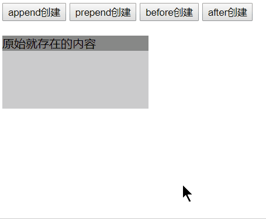
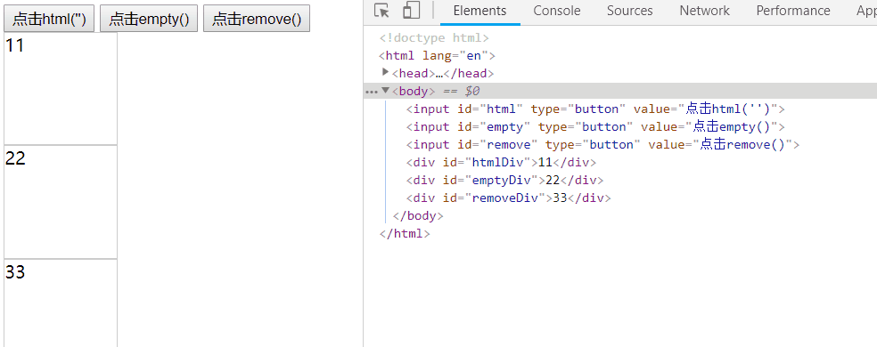
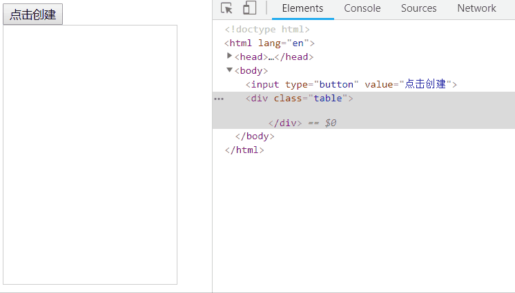
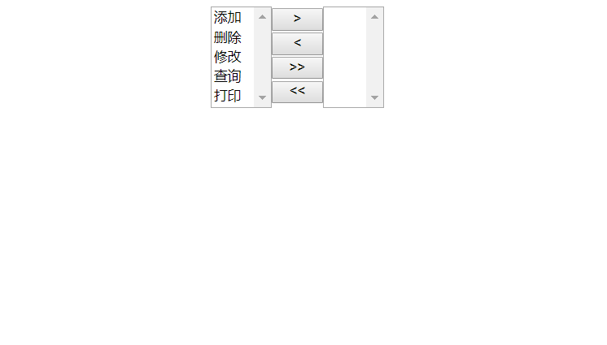
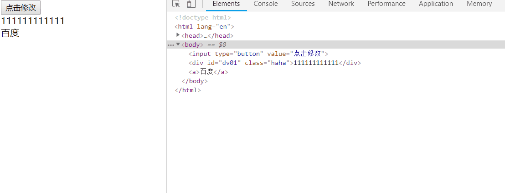

## 1. 元素的创建与移除
1. 元素的创建  
    1. 主要有四种形式
        1. append、appendTo：表示在当前元素内部，最后一个子元素的后面创建子元素
        1. prepend、prependTo：表示在当前元素内部，第一个子元素的前面创建子元素
        1. before：表示在当前元素外部，前面创建兄弟元素
        1. after：表示在当前元素外部，后面创建兄弟元素
    1. 代码：  
        ``` js
        <script>
            $(function(){
                $("#append").click(function(){
                    $("div").append($("<p>append创建</p>"))
                });
                $("#prepend").click(function(){
                    $("div").prepend($("<p>prepend创建</p>"))

                });
                $("#before").click(function(){
                    $("div").before($("<p>before创建</p>"))
                });
                $("#after").click(function(){
                    $("div").after($("<p>after创建</p>"))
                });
            })
        </script>
        <body>
            <input id="append" type="button" value="append创建">
            <input id="prepend" type="button" value="prepend创建">
            <input id="before" type="button" value="before创建">
            <input id="after" type="button" value="after创建">
            <div><p>原始就存在的内容</p></div>
        </body>
        ```
    1. 效果：  
        
1. 元素的移除
    1. 主要有3中形式    
        1. html(""):设置当前元素中的子元素为空
        1. empty():清空当前元素中所有的子元素
        1. remove():移除当前元素，包括所有子元素
    1. 代码：  
        ``` html
        <script>
            $(function(){
            $("#html").click(function() {
                $("#htmlDiv").html("");
            });
            $("#empty").click(function() {
                $("#emptyDiv").empty();
            });
            $("#remove").click(function() {
                $("#removeDiv").remove();
            });
            })
        </script>
        <body>
            <input id="html" type="button" value="点击html('')">
            <input id="empty" type="button" value="点击empty()">
            <input id="remove" type="button" value="点击remove()">
            <div id="htmlDiv" >11</div>
            <div id="emptyDiv">22</div>
            <div id="removeDiv">33</div>
        </body>
        ```
    1. 效果：
        
1. 案例01：动态创建表格
    1. 代码：  
        ``` html
        <script>
            $(function(){
                var arrData=[
                    {"name":"百度","href":"https://baidu.com"},
                    {"name":"Google","href":"https://google.com"},
                    {"name":"爱奇艺","href":"https://iqiyi.com"}
                ];

                $("input").click(function(){
                    var tableObj = $("<table border='1'></table>");
                    $(".table").append(tableObj);
                    for (var i = 0; i < arrData.length; i++) {
                        var element = arrData[i];
                        console.log(element);
                        var trObj = $("<tr></tr>");
                        tableObj.append(trObj);
                        var tdObj1= $("<td>"+element.name+"</td>");
                        var tdObj2= $("<td><a href='"+element.href+"'>"+element.name+"</a></td>");
                        tdObj1.appendTo(trObj);
                        tdObj2.appendTo(trObj);

                        trObj.mouseenter(function(){
                            $(this).css("background-color","#ccc");
                        }).mouseleave(function(){
                            $(this).css("background-color","");
                        })
                    }
                });
            })
        </script>
        <body>
            <input type="button" value="点击创建">
            <div class="table">

            </div>
        </body>
        ```
    1. 效果： 
        
1. 案例02：权限选择
    1. 代码：  
        ``` js
        $("#toAllRight").click(function(){
            $("#se1>option").appendTo($("#se2"));
        });
        $("#toAllLeft").click(function(){
            $("#se2>option").appendTo($("#se1"));
        });
        $("#toRight").click(function(){
            $("#se1>option:selected").appendTo($("#se2"));
        });
        $("#toLeft").click(function(){
            $("#se2>option:selected").appendTo($("#se1"));
        });
        ```
    1. 效果：  
        

## 1. 元素的val()方法的使用
1. 用在select标签上，则表示选择某个value的option
1. 文本域可以使用val()或者text()赋值
1. 代码：  
    ``` html
    <script>
        $(function(){
            $("input").click(function(){
                $("#sel").val("4");
                $("#text01").val("33333333333333333333333");    
                $("#text02").text("44444444444444444444444");    
            });
        })
    </script>
    <body>
        <input type="button" value="点击修改">
        <select name="haha" id="sel">
            <option value="1">11</option>
            <option value="2">22</option>
            <option value="3">33</option>
            <option value="4">44</option>
            <option value="5">55</option>
        </select>
        <textarea name="haha01" id="text01" cols="30" rows="10">1111111111111111111111</textarea>
        <textarea name="haha02" id="text02" cols="30" rows="10">2222222222222222222222</textarea>
    </body>
    ```
1. 效果：
    使用01.gif)

## 1. 自定义属性的获取与设置
1. 基本使用  
    1. 2种方式
        1. attr()
        1. prop()
    1. 代码： 
        ``` js
        $("input").click(function(){
            console.log($("#dv01").attr("class")); 
            $("#dv01").attr("class","biubiu"); 
            $("a").prop("href","https://baidu.com");
            console.log($("a").prop("href"));
        });
        ```
    1. 效果：  
        
1. 案例：操作单选框与复选框
1. 注意：在单选框组与复选框中，建议使用prop方法，因为attr方法是一次性的，不能多次使用

## 1. 元素的样式设置:宽和高,卷曲的距离,offset的系列的属性操作
1. 代码： 
    ``` js
    $("div").width(100).height(100); // jQuery自动加单位px
    $("div").offset({"left":500,"top":250});
    console.log($("div").offset());
    console.log($("div").offset().left);
    ```
1. 效果：  
    
## 1. jQuery中的事件绑定