## 1. 元素的事件绑定
1. 使用delegate方法为父元素的子元素绑定事件
    1. 为什么会有这种操作？  
        有些时候，我们需要为父元素中新生成的元素绑定事件，而常规的绑定形式只能用于已存在的元素，如果是在事件绑定之后生成的元素，则需要通过delegate方法绑定事件。
    1. 怎么理解delegate？  
        用法如下：```父元素.delegate("子元素","动作名(例如click、mouseenter等)",function(){...});```,从用法上可以看出，delegate表示动态地（代理地）为父类元素中所有的（包括现有的、以及在delegate方法执行后新生成的子元素）绑定事件
    1. 代码：  
        ``` js  
        $("#btn1").click(function(){
            $("<p>这是文本文本。。。。。</p>").appendTo($("div"));
            // 通过delegate方法，为父元素中的子元素绑定方法
            $("div").delegate("p","click",function(){
                console.log("我是第"+$(this).index()+"个p")
            });
        });
        $("#btn2").click(function(){
            $("<p>这是文本文本。。。。。</p>").appendTo($("div"));
        });
        ```
    1. 效果：  
        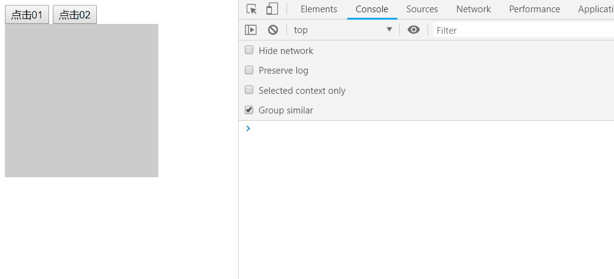  
    1. 唠叨两句： 
        1. 通过查看源码发现，```delegate```内部是通过```this.on```实现的，所以我们也可以通过直接调用```this.on```的方式实现动态地（代理地）为父类元素的子元素绑定事件;
        1. 更多的时候推荐使用```on```方法而不是``delegate````
        1. 代码：  
            ``` js
            $("div").on("click","p",function(){
                console.log("我是第"+$(this).index()+"个p")
            });
            ```
        1. on方法的形参说明： 
            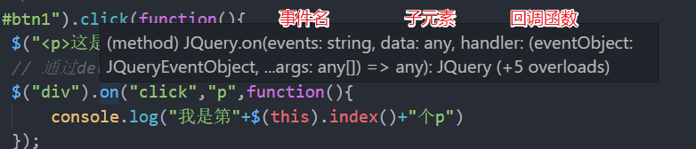
1. 案例： 动态为表格添加行与删除行
    1. 代码：  
        ``` js
        // 方法
        function closeFrame(){
            $("#j_mask").hide();
            $("#j_formAdd").hide();
        };
        function openFrame(){
            $("#j_mask").show();
            $("#j_formAdd").show();
        };

        // 事件
        $("#j_btnAddData").click(function(){
            openFrame();
            $("#j_txtLesson").val("");
            $("#j_txtBelSch").val("传智播客-前端与移动开发学院");
        });
        $("#j_hideFormAdd").click(function(){
            closeFrame();
        });
        $("table").on("click","a",function(){
        $(this).parent().parent().remove();
        });
        $("#j_btnAdd").click(function(){
        var nameObj = $("#j_txtLesson");
        var academyObj = $("#j_txtBelSch");
        $("<tr>"+"<td>"+nameObj.val()+"</td>"+"<td>"+academyObj.val()+"</td>"+"<td><a href='javascrip:;'class='get'>GET</a></td>"+"</tr>").appendTo($("tbody"));
        closeFrame();
        })
        ```  
    1. 效果：  
        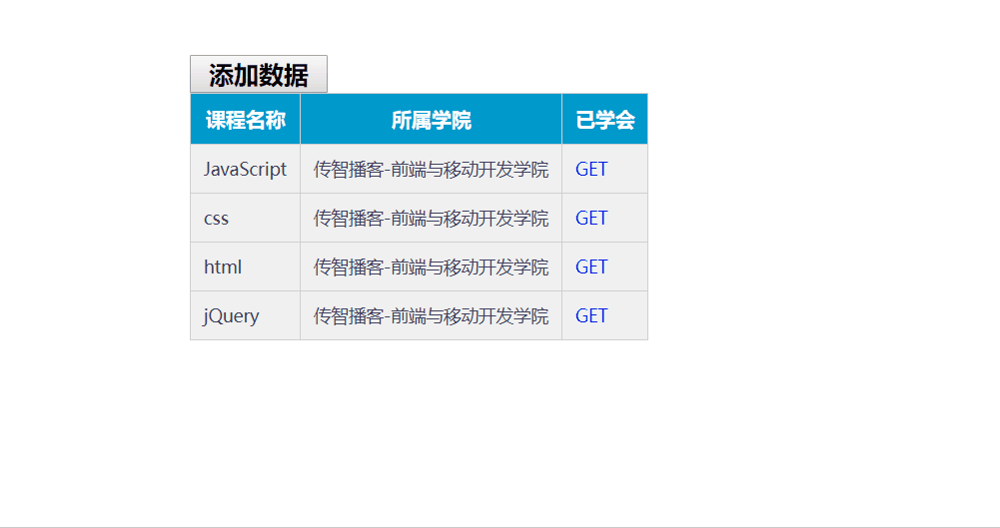

## 2. 元素的事件解绑
1. 用什么方式绑定的事件，最好就用对应的什么方法解绑事件
1. bind方式的解绑
    1. ```对象.unbind("事件名01 事件名02 ...")```
    1. 代码：  
        ``` html
        <script>
            $(function(){
                $("input:first").click(function(){
                    $("div").bind("mouseenter",function(){
                        console.log("div鼠标移入01");
                    }).bind("mouseleave",function(){
                        console.log("div鼠标移出02");
                    });
                });
                $("input:last").click(function(){
                    // $("div").unbind("mouseenter");
                    $("div").unbind("mouseenter mouseleave");
                });
            });
        </script>
        <body>
            <input type="button" value="绑定">
            <input type="button" value="解绑">
            <div></div>
        </body>
        ```
    1. 效果：  
        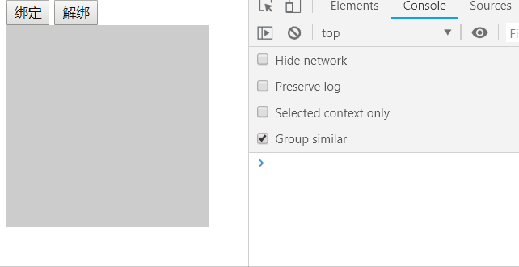
1. delegate方式的解绑
    1. delegate用于解绑动态地为父级元素的子元素解绑事件;
    1. 用法：```父类元素.undelegate("子类元素","事件01 事件02 ...");```
    1. ```父类元素.undelegate()```表示解绑所有事件
    1. 代码：  
        ``` html
         <script>
            $(function(){
                // 创建子元素并绑定事件
                $("input:first").click(function(){
                    $("<p>这是文本<?p>").appendTo($("div"));
                    $("div").delegate("p","mouseenter",function(){
                        console.log("鼠标移入");
                    }).delegate("p","mouseleave",function(){
                        console.log("鼠标移出");
                    });
                });
                // 解绑事件
                $("input:last").click(function(){
                    $("div").undelegate("p","mouseenter mouseleave");
                })
            })
        </script>
        <body>
            <input type="button" value="绑定">
            <input type="button" value="解绑">
            <div></div>
        </body>
        ```
    1. 效果： 
        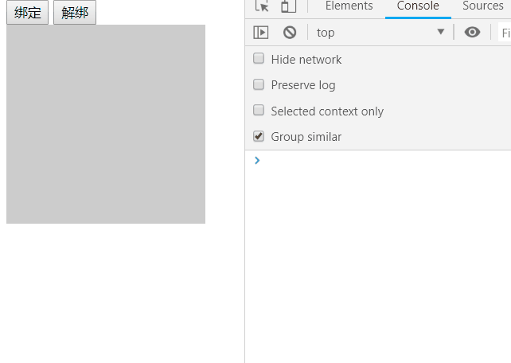
1. off方式的解绑
    1. 代码：  
        ``` html
        <script>
            $(function(){
                $("input:first").click(function(){
                    $("<p>这是文本</p>").appendTo($("div"));
                    // 通过on方法为div自己绑定事件
                    $("div").on("mouseenter",function(){
                        console.log("鼠标移入div");
                    }).on("mouseleave",function(){
                        console.log("鼠标移出div");
                    })
                    // 通过on方法为子元素绑定事件
                    .on("mouseenter","p",function(){
                        console.log("鼠标移入p");
                    }).on("mouseleave","p",function(){
                        console.log("鼠标移出p");
                    })
                });
                $("input:last").click(function(){
                    // 解绑自己及其所有子类的所有事件
                    // $("div").off(); 
                    // 解绑自己及其所有子类的所有mouseenter、mouseleave事件
                    // $("div").off("mouseenter mouseleave"); 
                    // 解绑所有子类p标签的所有mouseenter事件
                    // $("div").off("mouseenter","p"); 
                    // 解绑所有子类p标签的所有事件
                    // $("div").off("","p"); 
                    // 解绑所有子类的mouseenter事件
                    $("div").off("mouseenter","**"); 
                });
            })
        </script>
        <body>
            <input type="button" value="绑定">
            <input type="button" value="解绑">
            <div></div>
        </body>
        ```
    1. 效果： 
        

## 3. 事件冒泡与阻止冒泡
1. 核心代码：```return false;```
1. 代码： 
    ``` html
    <script>
        $(function(){
            $("#dv1").click(function(){
                console.log($(this).prop("id"),"被点了");
            })
            $("#dv2").click(function(){
                console.log($(this).prop("id"),"被点了");
            })
            $("#dv3").click(function(){
                console.log($(this).prop("id"),"被点了");
            });
            $("input").click(function(){
                // 解绑事件
                $("div").off();
                // 依次重新绑定阻止冒泡的点击事件
                $("#dv1").click(function(){
                    console.log($(this).prop("id"),"被点了");
                    return false;
                })
                $("#dv2").click(function(){
                    console.log($(this).prop("id"),"被点了");
                    return false;
                })
                $("#dv3").click(function(){
                    console.log($(this).prop("id"),"被点了");
                    return false
                });
            })
        })
    </script>
    <body>
        <input type="button" value="重新绑定阻止冒泡的点击事件">
        <div id="dv1">
            <div id="dv2">
                <div id="dv3"></div>
            </div>
        </div>
    </body>
    ```
1. 结果：  
    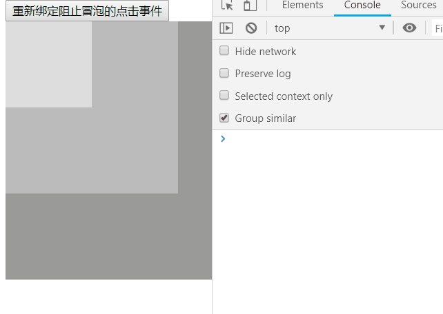

## 4. 事件触发
1. 什么是事件触发  
    就是原本需要鼠标或者某些行为触发A元素的a事件，现在通过另一个B元素触发A元素的a事件;
1. 事件触发的三种方式： 
    1. ```元素A.事件a();```
    1. ```元素B.trigger("事件a");```
    1. ```元素B.triggerHandler("事件a");```
1. 代码：  
    ``` html
    <script>
        $(function(){
            $("input:last").focus(function(){
                $("textarea").text("文本框获得焦点");
            });
            $("input:first").click(function(){
                $("input:last").focus();
                // $("input:last").trigger("focus");
                // $("input:last").triggerHandler("focus"); // 不触发浏览器事件（input中不出现光标）
            });
        })
    </script>
    <body>
        <input type="button" value="点击触发文本框聚焦事件"/> <br>
        <input type="text" style="width: 100px; height: 20px"/> <br>
        <textarea></textarea>
    </body>
    ```  
1. 效果：  
    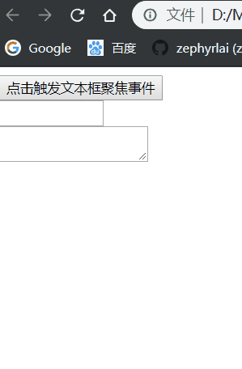

## 5. 事件参数
1. 通过查看function中的arguments对象，可以看到其中包含了一个事件参数对象
1. 案例：获取用户点击鼠标的时候同时按下的快捷键
    1. 代码：  
        ``` js
        $("div").click(function(e){
            if(e.altKey){
                console.log("按下alt键，按下了鼠标");
            }else if(e.shiftKey){
                console.log("按下shift键，按下了鼠标");
            }else if(e.ctrlKey){
                console.log("按下ctrl键，按下了鼠标");
            }else{
                console.dir(arguments);
            }
        })
        ```
    1. 效果：  
        

## 6. 链式编程的原理
1. 案例：星级评分
    1. 思路：
    1. 代码： 
        ``` html
        <script>
            $(function(){
                $("li").mouseenter(function(){
                    $(this).text("★").prevAll("li").text("★").end().nextAll("li").text("☆");
                }).click(function(){
                    $(this).attr("index","1").siblings("li").removeProp("index");
                });
                $("ul").mouseleave(function(){
                    // 清除所有实心的五角星，将含有自定义属性index及其之前的空心五角星设置为实心
                    $(this).find("li").text("☆");
                    // 注意下面的属性筛选器
                    $(this).find("li[index=1]").text("★").prevAll().text("★");
                })
            })
        </script>
        <body>
            <ul>
                <li>☆</li>
                <li>☆</li>
                <li>☆</li>
                <li>☆</li>
                <li>☆</li>
            </ul>
        </body>
        ```
    1. 效果： 
        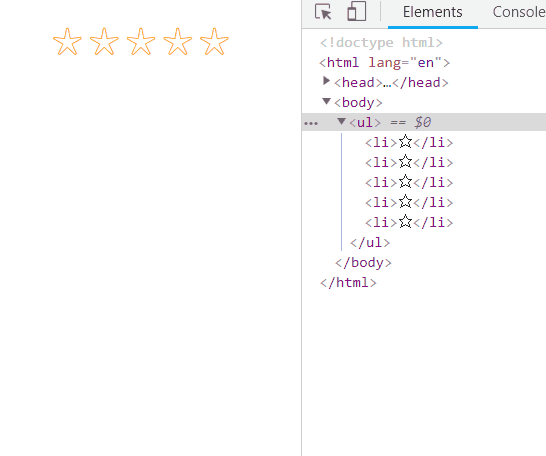

## 7. each方法的使用
1. 是jQuery内置的遍历方法
1. 代码：  
    ``` js
    $("input").click(function(){
        $("div").each(function(index,ele){
            var floatNum = index/10;
            $(ele).css("opacity",floatNum);
        })
    })
    ```
1. 效果：
    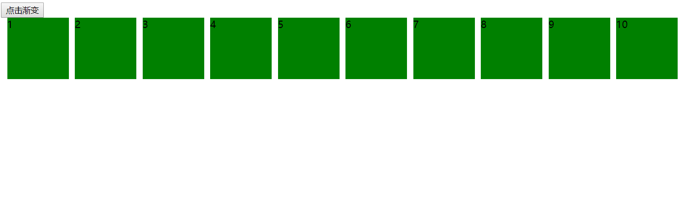

## 8. 多库共存的变量重名问题
1. 怎么会引发这种问题：比如刚好引入了多个js库，刚好$都是他们各自的顶级对象，这时就会出现问题
1. 怎么解决：两种形式（针对jquery的$）  
    1. 不使用$变量，转而使用jQuery变量
    1. 使用```$.noConflict();```重新定义jQuery的顶级对象
1. 代码：  
    ``` js
    var abc = $.noConflict();
        abc(function(){
            abc("input").click(function(){
                console.log(123);
            });
    })
    ```
1. 效果：  
    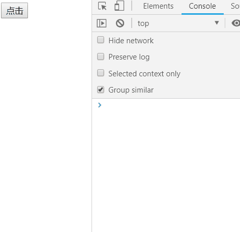

## 9. 包装集
1. jQuery中获取的所有的对象，都可以理解成是jQuery对dom的包装
1. 案例：动态创建元素时，不重复创建（已存在是不创建，不存在时就创建）
    1. 原理：在jQuery中，可以通过```$(选择器)[索引]```的方式获取当前jQuery对象对应的dom对象，于是，我们可以通过```$(选择器).length```的方式获取元素的数量，而当获取的length为0时，则表示目标元素不存在
    1. 代码：
        ``` js
        $("input").click(function(){
            if($("p").length==0){
                $("<p>这是文本</p>").appendTo($("div"));
            }
        });
        ```
    1. 效果： 
        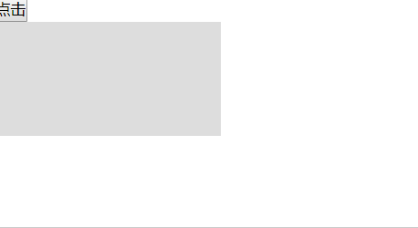

## 10. 插件的制作与使用
1. 插件制作
    1. 在js文件夹中，存放2个（类），一个是jQuery的js文件，另一个是插件的js文件
    1. 将实现基本功能的代码放在插件的js文件中
    1. css文件夹中放入css样式文件
    1. 要将封装的js方法添加到jQuery的"$.fn"中
1. 插件使用
    1. 引入css文件
    1. 引入jQuery文件----jquer-1.xx.x.js
    1. 引入插件的js文件
    1. 把index.html让复制的html代码加入到自己的body中(div中)
    1. 把index.html文件中的jQuery代码,复制到自己的script标签中即可

    * 插件的使用
    * 自己做插件
    * UI的使用

## 零散知识点
1. attr、prop在新增自定义属性上的区别
1. 几个属性
    1. 代码： 
        ``` js
        console.log("不包括边框的高度：",divObj.innerHeight());
        console.log("不包含边框的宽度：",divObj.innerWidth());
        console.log("包含边框的高度：",divObj.outerHeight());
        console.log("不好边框的宽度：",divObj.outerWidth());
        ``` 
    1. 效果： 
        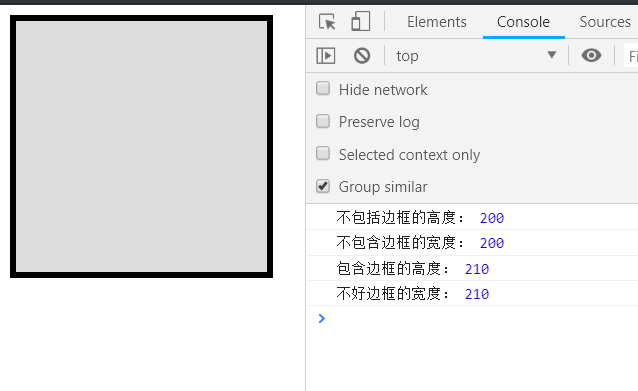

