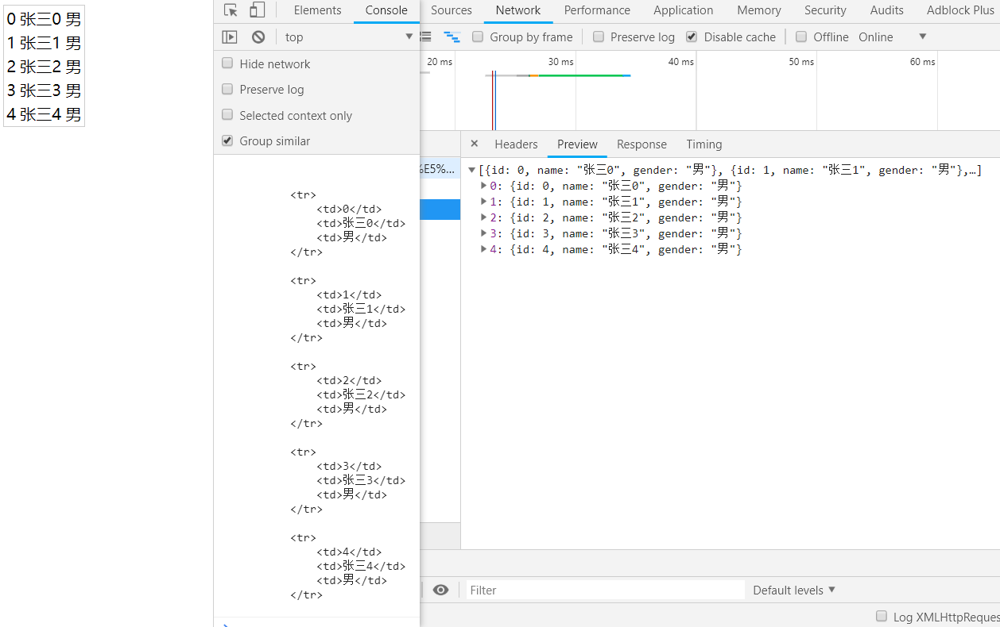
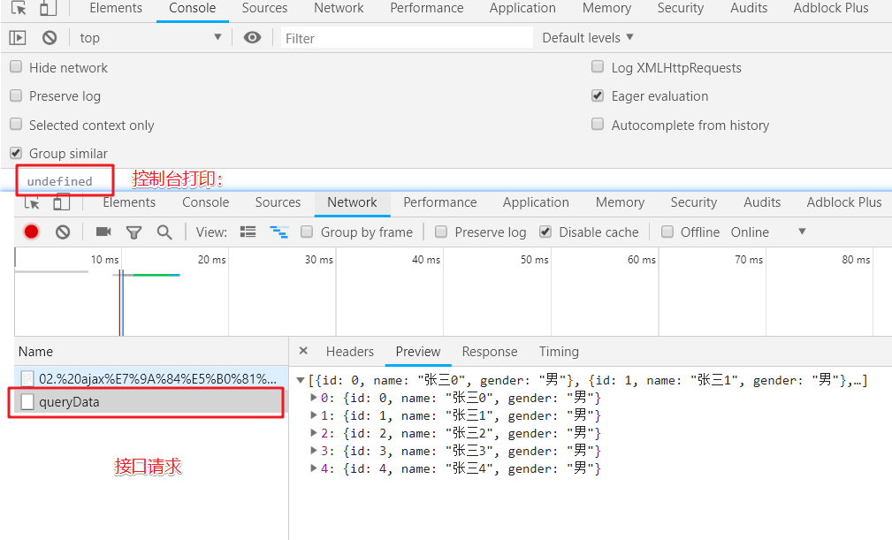
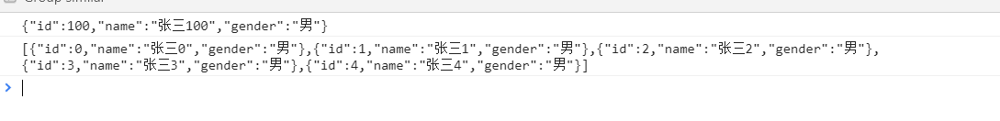

## 1. 模板引擎
1. 使用步骤
    1. 引入到页面中
    1. 准备一个模板，写在script标签中
    1. 准备一个数据
    1. 通过模板引擎的JS提供的一个函数将模板和数据整合得到渲染结果HTML
    1. 将渲染结果的HTML 设置到 默认元素的 innerHTML 中
1. 前端代码：  
    ``` html
    <!-- 原html结构中只有一个空的table标签 -->
    <body>
        <table id="table" style="border:1px solid #ccc"></table>
    </body>
    <!-- 引入模板引擎js -->
    <script src="template-web.js"></script>
    <!-- 定义html模板，注意是script标签，注意type -->
    <script id="myTemplate" type="text/x-art-template">
        {{each arrData}}
            <tr>
                <td>{{$value.id}}</td>
                <td>{{$value.name}}</td>
                <td>{{$value.gender}}</td>
            </tr>
        {{/each}}
    </script>
    <!-- Ajax请求数据 -->
    <script>
        var xhr = new XMLHttpRequest();
        xhr.open("get","http://localhost:8089/fontEnd/queryData");
        xhr.send();
        xhr.responseType="json";
        xhr.onload = function(){
            // 定义模板引擎渲染的数据
            var respData = {arrData:this.response};
            // 根据数据与模板，生成html代码
            var htmlCode = template("myTemplate",respData);
            console.log(htmlCode);
            // 将生成的html代码添加到页面上
            document.getElementById("table").innerHTML=htmlCode;
        };
    </script>
    ```
1. 后端代码：  
    ``` java
    @RequestMapping("queryData")    
    public  List<Student> queryData(){
        List<Student> stuList = new ArrayList<>();
        Student stu;
        for (int i = 0; i < 5; i++) {
            stu = new Student(i,"张三"+i,"男");
            stuList.add(stu);
        }
        return stuList;
    }
    ```
1. 效果： 
    

## 2. 封装Ajax方法
1. 最基础的封装
    1. 思路：按照常规的思维，封装样板代码，暴露请求方法、请求路径、请求参数，返回请求结果；
    1. 代码：  
        ``` js
        // 封装ajax请求方法-1：最基础的
        function myAjax(method,url,fn){
            var respData ;
            var xhr = new XMLHttpRequest();
            xhr.open(method,url);
            xhr.send();
            xhr.onload = function(){
                respData = xhr.response;
            }
            return respData;
        }
        console.log(myAjax("get","http://localhost:8089/frontEnd/queryData"));
        ```
    1. 效果：  
        
    1. 问题：并未按照预期返回需要的数值
    1. 原因：js的ajax请求默认是异步的，也就是刚发起请求，不管时候请求完成，将结果返回了，这样导致返回的结果是undefined
    1. 解决方式：暴露结果处理函数（回调函数），让ajax自己获取接口数据后，自己调用回调函数处理
1. 正经的封装
    1. 注意get、post方式请求时，传参上的区别；
    1. 代码：  
        ``` js
        // 封装ajax请求方法-3：封装get、post参数，传入回调函数
        function myAjax(method,url,params,fn){
            var xhr = new XMLHttpRequest();
            // get方式请求的参数直接设置到url中
            if(method.toUpperCase() == 'GET' && null != params){
                url += params;
            }
            xhr.open(method,url);
            // post方式请求的参数设置到send方法中
            if(method.toUpperCase() == 'POST' && null != params){
                // 设置Content-Type为表单方式，否则后端将无法接收到参数
                xhr.setRequestHeader("Content-Type","application/x-www-form-urlencoded")
                // 如果是obj，则遍历每条属性并拼接
                if(params instanceof Object){
                    var arr = [];
                    for (var key in params) {
                        var ele = params[key];
                        arr.push(key+"="+ele);
                    }
                    var postData = arr.join("&");
                }
            }   
            // 只有post请求，才会在send方法中传参
            xhr.send(postData);
            xhr.onload = function(){
                var respData = xhr.response;
                fn(respData);
            }
        }

        // 调用封装的函数
        myAjax("post","http://localhost:8089/frontEnd/queryById",{"id":100},function(data){
            console.log(data)
        })
        myAjax("get","http://localhost:8089/frontEnd/queryData",null,function(data){
            console.log(data)
        })
        ```
    1. 效果：  
         


## 零散知识点
1. reponse与responseText的区别