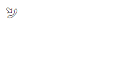

## 1. 3个meta标签
1. meta:charset  
    设置全局字符集  
    ```<meta charset="UTF-8">```
1. meta:viewport的作用： 
    让一个pc端的网页可以在移动端的浏览器正常访问，通常的写法是  
    ```<meta name="viewport" content="width=device-width, initial-scale=1.0 user-scalable=no">```  
    表示自动调整为设备宽度，缩放比例为1:1，不允许用户自行缩放。  
    有如下属性:  
        width:视口的宽度  
        initial-scale：初始化缩放  
        user-scalable:是否允许用户自行缩放（值：yes/no; 1/0）  
        minimum-scale:最小缩放，一般设置了用户不允许缩放，就没必要设置最小和最大缩放  
        maximum-scale:最大缩放  
1. meta:edge    
    设置浏览器的兼容版本模式（让ie使用最新的渲染引擎工作）  
    ```<meta http-equiv="X-UA-Compatible" content="ie=edge">```


## 1. 零散知识点
1. 条件注释：条件满足时，会执行注释中的HTML代码，如果条件不满足，则作为注释忽略  
    ``` html
    <!--[if lt IE 9]>
        <script src="lib/html5shiv/html5shiv.min.js"></script>
        <script src="lib/respond/respond.min.js"></script>
    <![endif]-->
    ```
1. 写css时的注意事项(防止相互协作之间，样式覆盖的问题)
    1. 样式都通过ID去限定
    1. 尽可能多使用直接子代选择器
1. css中相邻选择器（+与~）的使用
    1. +：相邻兄弟选择器，选中后面第一个（注意：不能与下一个兄弟元素之间不能间隔其他类型的元素，否则不能选中）
    1. ~：通用兄弟选择器，选中后续所有
    1. 代码： 
        ``` html
        <style>
            ul.ul01>.haha ~ li{
                color: #F40;
            }
            ul.ul02>.haha + li{
                color: #F40;
            }
        </style>
        <body>
            <ul class="ul01">
                <li></li>
                <li class="haha">通用兄弟选择器，选中后续所有</li>
                <li></li>
                <li></li>
                <span>span</span>
                <li></li>
            </ul>
            <ul class="ul02">
                <li></li>
                <li class="haha">相邻兄弟选择器，选中后面第一个</li>
                <li></li>
                <li></li>
                <li class="haha">不能与下一个兄弟元素之间不能间隔其他类型的元素，否则不能选中</li>
                <span>span</span>
                <li></li>
                <li></li>
            </ul>
        </body>
        ```
    1. 
1. css中字体图标的使用（之前都是直接拷的代码，现在稍微讲解一下）
    1. 声明@font-face： 
        1. font-family：声明一下字体图标名（自己定义）
        2. url：引入字体图标的文件（各浏览器兼容状况不同，最好4种文件都引入）
    1. 目标元素声明一下font-family
    1. 添加字体图标
        通常采用如下形式：  
        ``` css
            目标元素::before{
                content: "XXX";
                font-size: XXXpx;
            }
        ```
    1. 代码： 
        ``` html
        <style>
            @font-face{
                font-family: "haha";
                src:    url('../weijinsuo/font/MiFie-Web-Font.eot') format('embedded-opentype'), 
                        url('../weijinsuo/font/MiFie-Web-Font.svg') format('svg'), 
                        url('../weijinsuo/font/MiFie-Web-Font.ttf') format('truetype'), 
                        url('../weijinsuo/font/MiFie-Web-Font.woff') format('woff');
            }
            span::before {
                content: "\e909";
                font-size: 15px;
            }
            .icon-font{
                font-family: "haha";
            }
        </style>
        <body>
            <span class="icon-font"></span>
        </body>
        ```
    1. 效果： 
        
1. css的属性选择器
    1. [attr=xx]是css的属性选择器
    1. [attr^=abc]是css的属性选择器,表示对以abc __开头__ 的属性所在元素有效
    1. [attr*=def]是css的属性选择器，表示对 __包含__ def的属性所在的元素有效
1. 自动生成bootstrap按钮样式  
    http://blog.koalite.com/bbg/
1. 文字与图片基线对齐的css属性：```vertical-align:middle;```
1. 背景色透明的css属性：```background-color:transparent;```
1. 自定义bootstrap样式（结合浏览器进行细节调整，以导航栏样式 .nav-default为例）
    1. 在bootstrap.js中找到所有含有“.nav-default”的css代码并拷贝到自己的css文件（例如：my-navbar.css）中
    1. 将my-navbar.css中所有的“nav-default”改为自定义样式的名字（例如：nav-zephyr）
    1. 在浏览器中微调样式，然后在source栏中定位css源码，会写到css文件中
    1. TODO: 此处缺图
